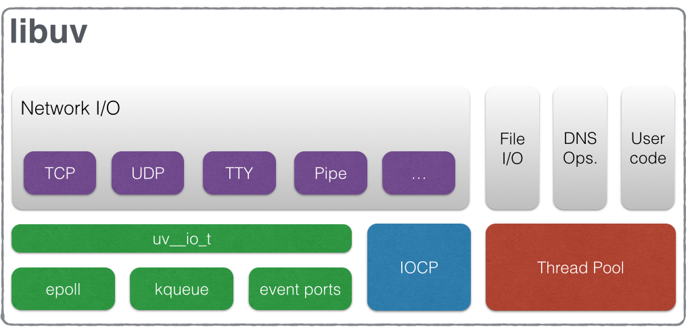

### 为啥是libuv

#### 背景
node.js最初开始于2009年，是一个可以让Javascript代码离开浏览器的执行环境也可以执行的项目。 node.js使用了Google的V8解析引擎和Marc Lehmann的libev。Node.js将事件驱动的I/O模型与适合该模型的编程语言(Javascript)融合在了一起。随着node.js的日益流行，node.js需要同时支持windows, 但是libev只能在Unix环境下运行。Windows 平台上与kqueue(FreeBSD)或者(e)poll(Linux)等内核事件通知相应的机制是IOCP。libuv提供了一个跨平台的抽象，由平台决定使用libev或IOCP。在node-v0.9.0版本中，libuv移除了libev的内容。

#### 为啥是异步

我们先看一张表：

| 分类 | 操作 | 时间成本 |
| --- | --- | ---   |
| 缓存 | L1缓存 | 1纳秒 |
|     | L2缓存 | 4纳秒 |
|     | 主存储器 | 100 ns |
|     | SSD 随机读取 | 16000 ns |
| I/O | 往返在同一数据中心 | 500000 ns |
|     | 物理磁盘寻道 | 4,000,000 ns |

我们看到即便是 SSD 的访问相较于高速的 CPU，仍然是慢速设备。于是基于事件驱动的 IO 模型就应运而生，解决了高速设备同步等待慢速设备或访问的问题。这不是 libuv 的独创，linux kernel 原生支持的 NIO也是这个思路。 但 libuv 统一了网络访问，文件访问，做到了跨平台。

### libuv 架构

从左往右分为两部分，一部分是与网络I/O相关的请求，而另外一部分是由文件I/O, DNS Ops以及User code组成的请求。

从图中可以看出，对于Network I/O和以File I/O为代表的另一类请求，异步处理的底层支撑机制是完全不一样的。

对于Network I/O相关的请求， 根据OS平台不同，分别使用Linux上的epoll，OSX和BSD类OS上的kqueue，SunOS上的event ports以及Windows上的IOCP机制。

而对于File I/O为代表的请求，则使用thread pool。利用thread pool的方式实现异步请求处理，在各类OS上都能获得很好的支持。

笔者曾经给 libuv 社区提出过linux 平台下用原生的NIO替换 thread pool 的建议并实现[2],测试发现有3%的提升. 考虑到 NIO 对内核版本的依赖，利用thread pool的方式实现异步请求处理，在各类OS上都能获得很好的支持，相信是 libuv 作者权衡再三的结果。

后面详细的模块源码分析时，陆续的会一一剖析。

### 参考

- [1]. http://luohaha.github.io/Chinese-uvbook/
- [2]. https://github.com/libuv/libuv/issues/461
