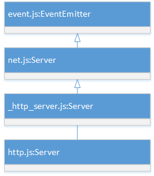

### 从「hello world」讲起

先贴一段代码，再熟悉不过，https://nodejs.org/en/about/， 和学习每一种语言一样，从一个简单「hello world」程序对 node.js 有个感性的认识。
```js
const http = require('http');
const hostname = '127.0.0.1';
const port = 1337;

http.createServer((req, res) => {
  res.writeHead(200, { 'Content-Type': 'text/plain' });
  res.end('Hello World\n');
}).listen(port, hostname, () => {
  console.log(`Server running at http://${hostname}:${port}/`);
});
```
我们从第一句代码看看到底涉及了多少核心模块，让我们开启 node.js 源码分析之旅吧。

第一句： `const http = require('http');` 就涉及到2个模块，分别是module 和 http 模块。

主体代码
```js
http.createServer((req, res) => {
  res.writeHead(200, { 'Content-Type': 'text/plain' });
  res.end('Hello World\n');
}).listen(port, hostname, () => {
  ...
});
```

- 首先了解一下HTTP Server的继承关系，有利于更好的理解代码。



这就又涉及了 event和net模块。

最后一句：
```js
console.log(`Server running at http://${hostname}:${port}/`);
```
这里用到了 console模块，但却没有通过 `require` 获取，这就要说到global对象了，Node.js的顶层对象。这里笔者先卖个关子，后面会在 global 章节中详细讲述。


如果想查看 node 的一些调试日志，可以通过设置 NODE_DEBUG 环境变量，比如：
```shell
NODE_DEBUG=HTTP,STREAM,MODULE,NET node http.js
```
查看 V8的日志
```shell
node --trace http.js
```

### 总结
一个简单的 hello world 程序却涉及了多个模块，背后却是 Node社区智慧的结晶，在 web服务，异步 IO 上的高度抽象。真所谓大道至简！

下面以Linus Torvalds的一句名言来开启Node.js的源码之旅吧。

> Talk is cheap, show me the code.

